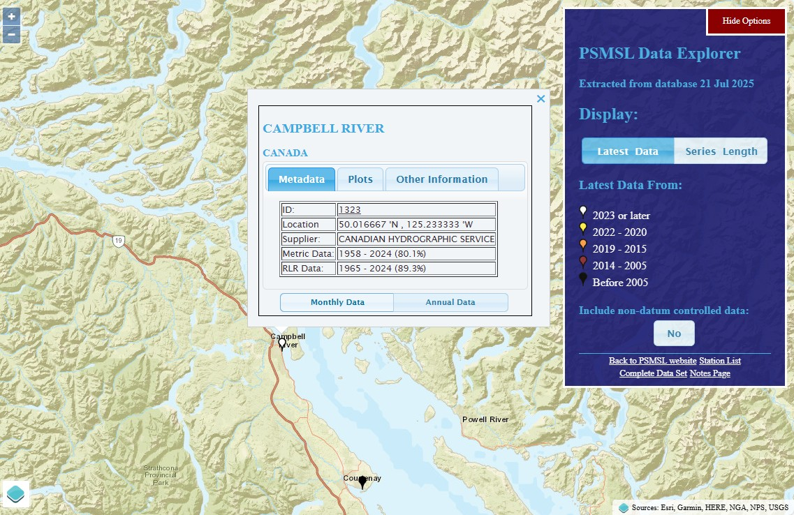

# Supplementary Information

## Spatiotemporal trends in global-scale oyster norovirus outbreaks: critical review on climate change association
**Naresh Suwal, Zhiqiang Deng\***

Department of Civil and Environmental Engineering, Louisiana State University, Baton Rouge, Louisiana 70803, USA  
**Corresponding author: E-mail address: zdeng@lsu.edu (Z. Deng); nsuwal1@lsu.edu (N. Suwal)*

---

## Supplementary User Manual for Statistical Analysis

### Data Collection
The oyster norovirus outbreak data were collected from the US Centers for Disease Control and Prevention (CDC), the UK Health Security Agency (UKHSA), the Food Standards Agency (FSA), the Public Health Agency of Canada (PHAC), and the National Public Health Emergency Event Surveillance System (PHEESS). The data for climatic factors were collected from different online sources. Sea surface height for Louisiana coast is downloaded from Estimating the Circulation and Climate of the Ocean (ECCO) data repository. This dataset provides monthly-averaged dynamic sea surface height fields derived from the ECCO Version 4 Release 4 (V4r4) ocean and sea-ice state estimate for the period 1992–2018. The minimum water temperature data for Louisiana coast were downloaded from the National Water Information System (NWIS) mapper (Water Resources, U.S). The data for precipitation, all-sky surface shortwave downward irradiance (MJ/m2/day), and minimum temperature at 2 meters were downloaded from the NASA (National Aeronautics and Space Administration) Power data access viewer (NASA Power). The sea surface height data for British Columbia and Southeast England were collected from permanent service for mean sea level (PSMSL).

### Louisiana Coast
#### Water temperature

Navigate to the USGS website URL: [Water Resources of the United States—National Water Information System (NWIS) Mapper](https://waterdata.usgs.gov/nwis). This is the primary source for downloading the necessary insitu data such as water temperature, gage height, discharge, and many other for United States. The present study used USGS station number 07374526 for representative water temperature for Louisiana coast. 


_Figure S1 USGS website home page_

At home page of USGS website enter the site numbers and click enter, then it will be taken to the station data. 


_Figure S2 Station details with available data range_

#### Precipitation and Solar Radiation

Navigate to the Nasa Power website URL: [NASA POWER | Data Access Viewer (DAV)](https://power.larc.nasa.gov/data-access-viewer/). From this website, the required solar radiation and precipitation can be downloaded. 


_Figure S3 Nasa Power website home page with single point selection at Louisiana coast_

#### Sea surface height

Navigate to the NASA Sea Level Change Data Analysis Tool (DAT) website URL: [Data Analysis Tool – NASA Sea Level Change Portal](https://sealevel.nasa.gov/data/data-analysis-tool). Then, click launch as shown in Figure S4.


_Figure S4 Home page of Nasa Sea Level Change Date Analysis Tool_

After clicking launch, select Sea surface height  (ECCO v4r4) and select the point or boundary and select the start and end date. Then, click create chart, then it will show like in Figure S5. Then, click download from the chart to download the sea surface height data for required position of required date range.


_Figure S5 Sea surface height chart from which data is downloaded_

### British Columbia and Southeast England
#### Precipitation, Minimum Temperature at 2 meters, and Solar Radiation

Navigate to the Nasa Power website URL: [NASA POWER | Data Access Viewer (DAV)](https://power.larc.nasa.gov/data-access-viewer/). From this website, the required solar radiation, precipitation, and minimum temperature at 2 meters can be downloaded. The home page with selection is shown in Figure S6.


_Figure S6 Nasa Power website home page with single point selection at Louisiana coast_

#### Sea surface height

Navigate to the permanent service for mean sea level website URL: [Permanent Service for Mean Sea Level (PSMSL)](https://www.psmsl.org/). Figure S7 is the home page of PSMSL. Click on the word map it will lead to the Figure S8 from where we can select the needed station and download the monthly sea surface height. 


_Figure S7 PSMSL home page_



_Figure S8 Campbell River station details and from monthly data button monthly sea surface height_

### Data Processing
The daily minimum temperature and daily solar radiation data were converted into moving ten-day averages. From these ten-day averages, monthly minimum values for temperature and solar radiation were generated. These monthly minimum values were then used to obtain the minimum value for the winter season (November to April) of a specific year. For precipitation, a five-day moving sum was calculated, from which the maximum monthly values were derived. These maximum monthly precipitation values were then employed to determine the maximum seasonal precipitation for the winter season of a specific year. For sea surface height data, the original data were at monthly intervals. These monthly data were directly used to calculate the seasonal maximum sea surface height for the winter season of a specific year. This process was repeated for all the available years of data. In the end, the current study used seasonal maximum or minimum time series data for all the considered climatic factors,including solar radiation, sea surface height, minimum temperature, and precipitation.

### Trend Analysis (Mann-Kendall test and Sen’s slope)
**Example: Minimum temperature at Louisiana coast**
The following python code was used to calculate Mann-Kendall test and Sen’s slope.

```python
import pandas as pd
import numpy as np
import matplotlib.pyplot as plt
from scipy.stats import kendalltau

# Load the data
data = pd.read_excel('Sea_10D_TMIN_A.xlsx')

# Extract relevant columns
years = data['Year']
winter_values = data['Winter']

# Apply the Mann-Kendall Trend Test
tau, p_value = kendalltau(years, winter_values)

# Calculate Sen's slope
def sens_slope(x, y):
	n = len(y)
	slopes = []
	for i in range(n - 1):
		for j in range(i + 1, n):
			slopes.append((y[j] - y[i]) / (x[j] - x[i]))
	return np.median(slopes)

sen_slope = sens_slope(years, winter_values)

# Line plot with trend line and displaying Kendall Tau, P-value, and Sen's slope
plt.figure(figsize=(14, 8))
plt.plot(years, winter_values, marker='o', linestyle='-', label='Minimum Temperature(TMIN)')
plt.xlabel('Year', fontsize=14, fontweight='bold')
plt.ylabel('Minimum Temperature (\u00B0C)', fontsize=14, fontweight='bold')

# Set the font size of the tick labels
plt.xticks(fontsize=12)
plt.yticks(fontsize=12)

# Add trend line
z = np.polyfit(years, winter_values, 1)
p = np.poly1d(z)

# Determine if the trend is increasing or decreasing
trend_label = 'Trend Line (Increasing)' if z[0] > 0 else 'Trend Line (Decreasing)'

# Plot the trend line with the updated label
plt.plot(years, p(years), "r--", label=trend_label)

# Add legend with increased font size
plt.legend(loc='lower left', fontsize=12)

# Add legend and Kendall Tau/P-value/Sen's slope text
plt.text(0.3, 0.1, f'Kendall Tau: {tau:.3f}\nP-value: {p_value:.2e}\nSen\'s Slope: {sen_slope:.3f}', 
		 transform=plt.gca().transAxes, fontsize=12, verticalalignment='top')

plt.savefig('TMIN_LA_1.tiff', dpi=300)
plt.show()
```

### Software and Dependencies
The analysis was conducted in Python (version 3.11). The required packages and their versions are:
- **pandas** (version 2.2.2): For data loading and manipulation.
- **numpy** (version 1.26.4): For numerical computations.
- **scipy** (version 1.11.4): For the Mann-Kendall test.
- **matplotlib** (version 3.8.2): For plotting.
- **openpyxl** (version 3.1.2): For reading Excel files.

### Example results


_Figure S9 Ten-day moving average seasonal minimum temperature trend at Louisiana coast_

For all other study areas climatic factors and outbreak data, above python code can be used changing the excel file name but make sure it contains dataset includes two primary columns: Year (the year of observation) and Winter (the minimum temperature in degrees Celsius for the winter season). In this way, using this manual the trend of the climatic factors and outbreak data can be studied. 

